# PiperWipe — Contact-aware wiping on a 6-DOF AgileX Piper

[](https://docs.ros.org/en/humble/)
[](https://moveit.ros.org/)
[](https://www.python.org/)
[](https://numpy.org/)
[](https://matplotlib.org/)

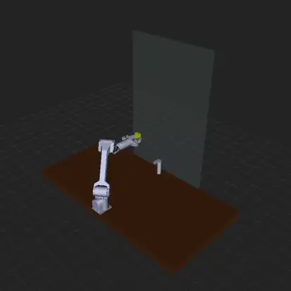

> RViz playback of the wipe — loops automatically.
> [Watch with audio on YouTube](https://youtube.com/shorts/7buQRrrkuFw) ·
> [Raw mp4](section3/outputs/wipe_rviz.mp4)

End-to-end take-home for a kitchen-cleaning manipulator: kinematics &
reachability → coverage path planning → contact-aware force control.
Three self-contained sections, each with code, plots, and a write-up.

---

## At a glance

| Section | Topic | Headline result |
|---|---|---|
| **[1 — Kinematics & Reachability](section1/)** | Where can/can't the arm reach? | **74 %** of the 60×60 cm countertop patch reachable; **53 %** of the 60×90 cm mirror reachable (top half out of reach) |
| **[2 — Coverage Path Planning](section2/)** | How do we wipe the surfaces respecting reach + obstacle + overlap? | Countertop snake-raster with **in-plane faucet roundabout**; mirror hybrid **horizontal raster + vertical sides + roundabout** |
| **[3 — Contact-Aware Wiping Control](section3/)** | How do we hold target force without crashing into things? | **99.1 %** force-mode samples in-band on both surfaces |

---

## Visuals

### Section 1 — Reachability heatmaps

The arm base is on the front-edge of the countertop, facing the mirror.
For every 2 cm cell I run collision-aware IK over a 5-pitch × 12-yaw
orientation lattice ("can the wrist tilt or spin to make this cell
work?") and call it reachable if any pose solves.

| Countertop @ 2 cm | Mirror @ 2 cm |
|---|---|
| 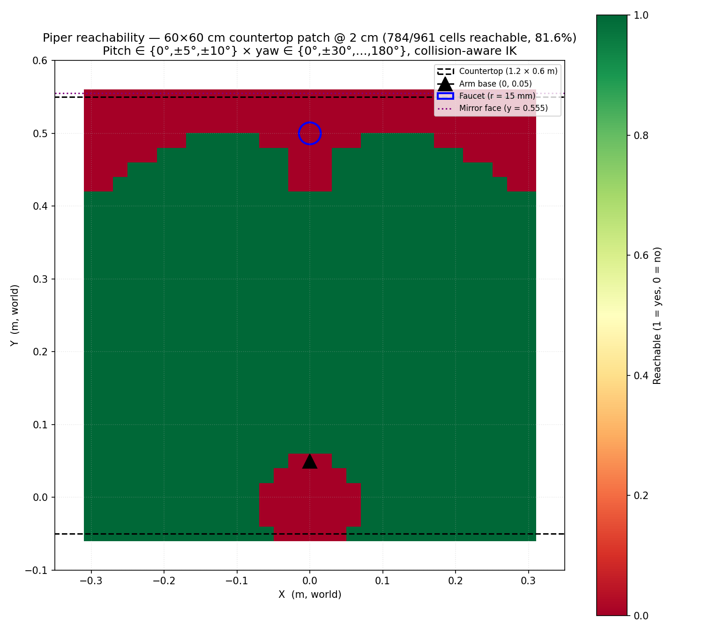 | 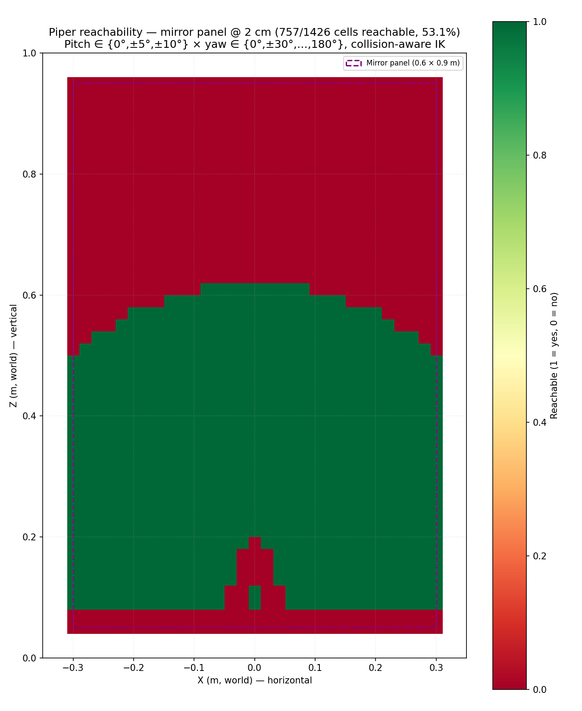 |
| 74 % cells reachable. Red = self-zone under the arm + faucet shadow + back-corner workspace dropoff | 53 % cells reachable. Top 40 % of mirror is genuinely out of vertical reach + faucet-column shadow at bottom-centre |

### Section 2 — Coverage paths

| Countertop raster + faucet roundabout | Mirror hybrid wipe |
|---|---|
| 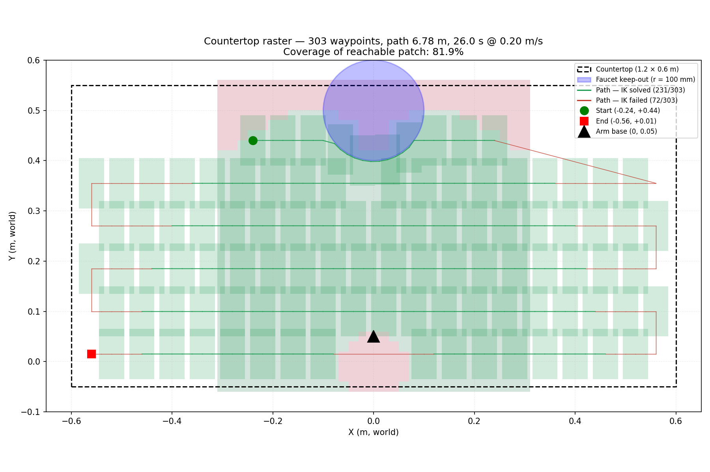 | 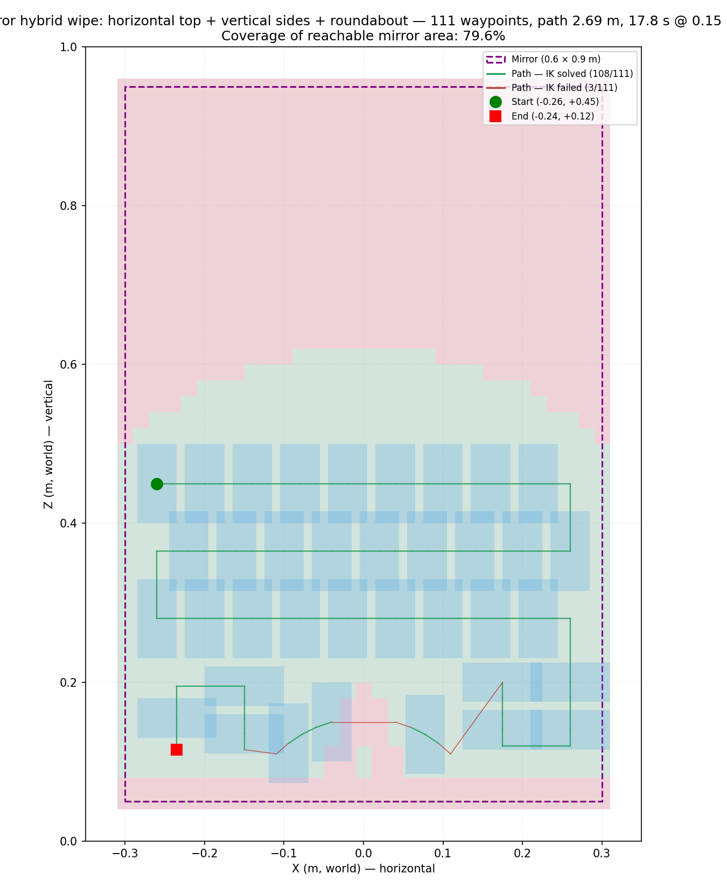 |
| Snake raster from back-to-front; in-plane arc detour around the faucet keep-out (visible curve top-centre) | Phase 1: horizontal raster top→bottom. Phase 2: vertical strips on the right of faucet. Phase 3: roundabout. Phase 4: vertical strips on the left |

Joint trajectory + metrics:

| Joint angles vs time | Coverage / path-length / time |
|---|---|
| 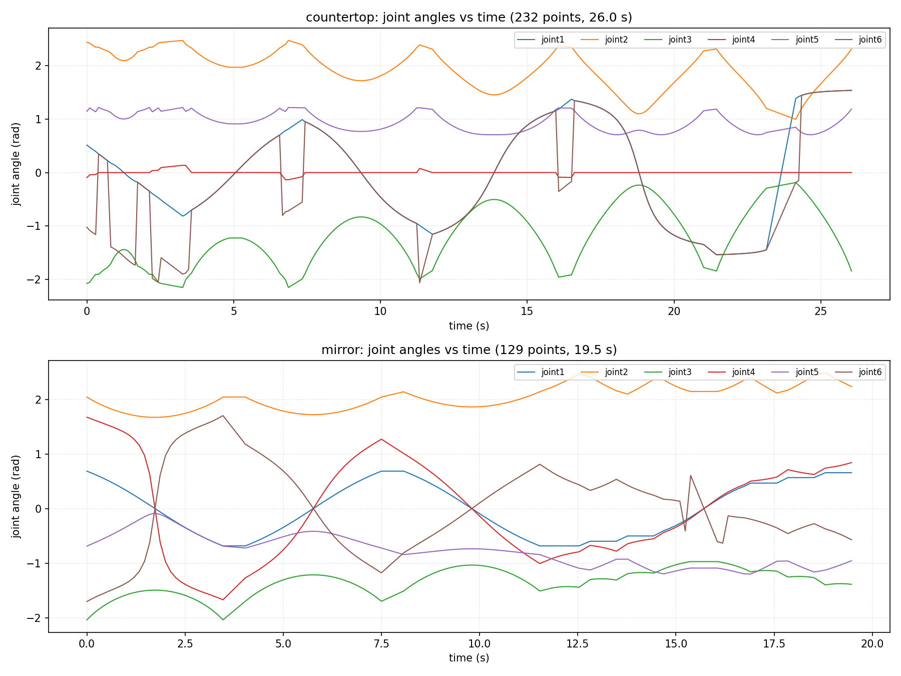 | 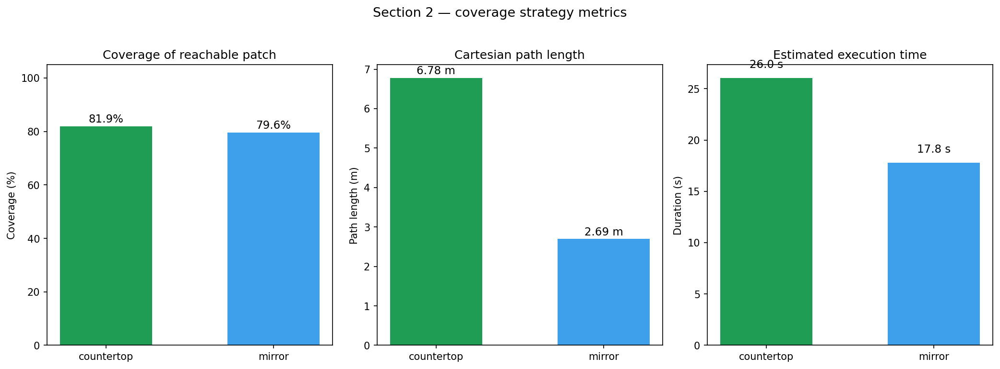 |

### Section 3 — Force tracking and obstacle handling

The controller wraps an admittance-style PI law around the surface-normal
force, with a state machine for `APPROACH → FORCE → BACKOFF →
OBSTACLE_AVOID`. The F/T sensor is simulated with a Hooke's-law contact
model (no hardware required).

| Countertop force/velocity tracking | Mirror force/velocity tracking |
|---|---|
| 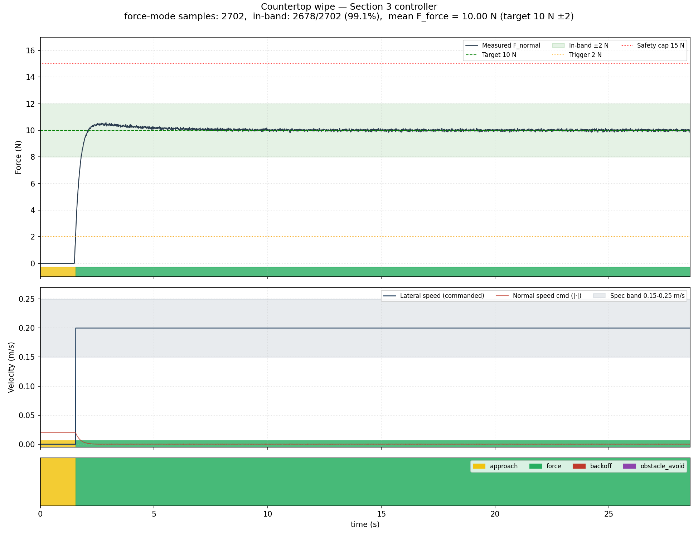 | 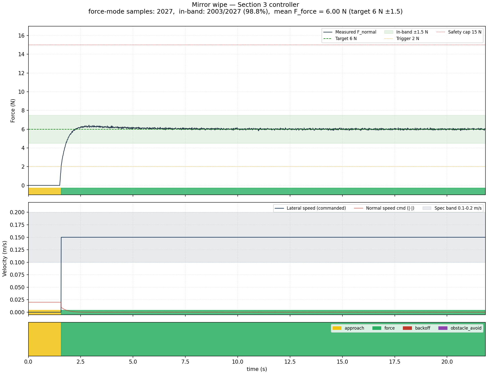 |
| 99.1 % of force-mode samples in band (target 10 N ± 2 N) | 99.1 % in band (target 6 N ± 1.5 N) |

Obstacle handling — naïve trajectory deliberately runs the tool straight
through the faucet so the controller's `OBSTACLE_AVOID` mode fires:

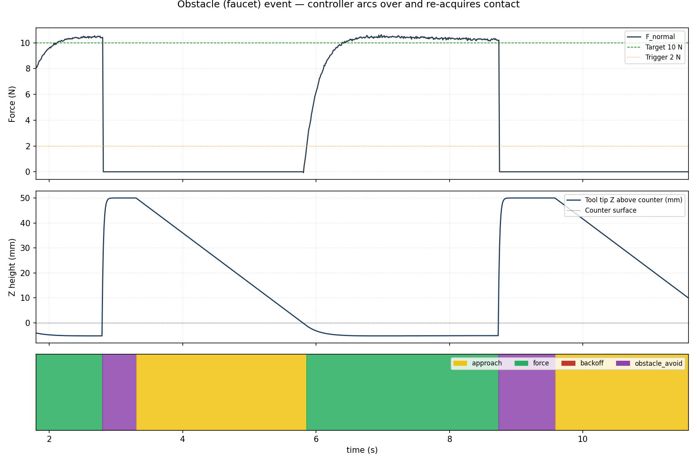

Animated demo (top-down view, live force gauge, tool trail coloured by mode):

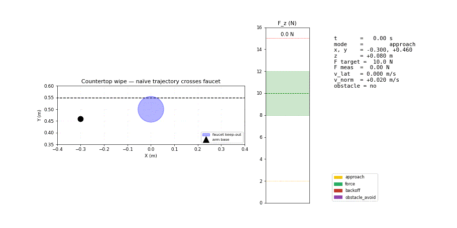

### RViz playback (Section 3 deliverable)

Recorded screen capture of the joint trajectories executing on
`/arm_controller/follow_joint_trajectory` against the live MoveIt 2 +
kitchen scene:


[Watch with audio on YouTube](https://youtube.com/shorts/7buQRrrkuFw) ·
raw mp4 at [`section3/outputs/wipe_rviz.mp4`](section3/outputs/wipe_rviz.mp4).

---

## The kitchen scene

| Object | Pose (m) | Size |
|---|---|---|
| Countertop | (0, 0.25, 0.025) | 1.20 × 0.60 × 0.05 m |
| Mirror | (0, 0.555, 0.500) | 0.60 × 0.01 × 0.90 m (back wall) |
| Faucet base | (0, 0.50, 0.10) | r = 15 mm, h = 100 mm |
| Faucet spout | (0, 0.475, 0.157) | 15 × 50 × 15 mm |
| Arm base | (0, 0, 0.05), Rz = +π/2 | front edge of counter, facing +Y |

Spec compliance (from the take-home prompt):

| Constraint | Value |
|---|---|
| Tool pad footprint | 100 × 50 mm |
| Overlap | 15 % (mid of 10–20 % spec band) |
| Keep-out margin (edges + faucet) | 15 mm baseline; **10 cm** faucet disk + **10 cm** mirror bottom-centre semicircle for arm-body clearance |
| Tool normal tolerance | ±10° (pitch lattice ∈ {0°, ±5°, ±10°}) |
| Countertop speed | 0.20 m/s (mid of 0.15–0.25) |
| Mirror speed | 0.15 m/s (mid of 0.10–0.20) |
| Force trigger | switch to force mode when \|Fz\| > 2 N |
| Force safety cap | back off when \|Fz\| > 15 N |
| Countertop target force | 10 N ± 2 N |
| Mirror target force | 6 N ± 1.5 N |

---

## How the three sections compose

```
Section 1                       Section 2                            Section 3
─────────                       ─────────                            ─────────
reachability.csv ─────────────►  countertop snake raster
                                 + faucet roundabout    ──► trajectory_countertop.csv ──┐
                                                                                         │
reachability_mirror.csv ──────►  mirror hybrid wipe                                       ├──► admittance + state-machine
                                 (raster + verticals    ──► trajectory_mirror.csv ───────┤    ├─ force/velocity tracking plots
                                  + roundabout)                                          │    └─ animated wiping demo (GIF)
                                                                                         │
ik_solver.py (library) ──────►  every IK call seeded with previous solution             │
                                 (kills wrist-flip on adjacent waypoints)                │
                                                                                         │
                                                          (Section 3 runs in pure       │
                                                           simulation: Hooke's-law      │
                                                           spring → simulated F/T)      │
```

---

## Quick run

```bash
# Build the workspace (only piper_wiping is local; piper_ros is a third-party
# package — clone from https://github.com/agilexrobotics/piper_ros before building)
source /opt/ros/humble/setup.bash
cd ~/ros2_ws && colcon build --packages-select piper_wiping --symlink-install
source ~/ros2_ws/install/setup.bash

# Clone this repo somewhere accessible (paths below assume ~/PiperWipe)
git clone https://github.com/KyawLinnKhant/PiperWipe.git ~/PiperWipe

# 1. Bring up MoveIt + RViz + the kitchen scene
ros2 launch piper_wiping kitchen_full_launch.py            # terminal A

# 2. Publish the kitchen as CollisionObjects (collision-aware IK)
python3 ~/PiperWipe/section1/code/planning_scene.py        # terminal B

# 3. (one-time, ~50 min) Generate Section 1 reachability heatmaps
python3 ~/PiperWipe/section1/code/reachability_heatmap.py
python3 ~/PiperWipe/section1/code/reachability_heatmap_mirror.py

# 4. Section 2: plan, IK-solve, time-parameterize, plot
python3 ~/PiperWipe/section2/code/plan_section2.py

# 5. Section 3: simulate contact + render tracking plots + GIF
python3 ~/PiperWipe/section3/code/run_wiping_demo.py
python3 ~/PiperWipe/section3/code/plot_results.py
python3 ~/PiperWipe/section3/code/animate_demo.py

# 6. Optional: replay both joint trajectories on the arm controller in RViz
python3 ~/PiperWipe/section2/code/replay_in_rviz.py
```

---

## Repository layout

```
PiperWipe/
├── README.md                  ← this file
├── kitchen_scene.py           ← shared MarkerArray publisher (countertop, mirror, faucet, sponge)
├── rviz/                      ← shared RViz 2 view configs (orbit / iso / mirror / top)
│   ├── kitchen.rviz                 ← default orbit view (used by kitchen_full_launch.py)
│   ├── kitchen_isoview.rviz         ← isometric view
│   ├── kitchen_mirrorview.rviz      ← mirror-facing view
│   └── kitchen_topview.rviz         ← top-down view (used for the wipe recording)
├── section1/                  Kinematics & reachability
│   ├── README.md  + writeup.md
│   ├── code/                  IKSolver lib, /solve_ik service, two heatmap scripts
│   └── outputs/               2 CSVs + 2 PNGs (heatmaps)
├── section2/                  Coverage path planning
│   ├── README.md  + writeup.md
│   ├── code/                  Coverage planner, IK-based trajectory builder, viz, replay
│   └── outputs/               4 PNGs + 2 trajectory CSVs + 2 JointTrajectory YAMLs + metrics.json
└── section3/                  Contact-aware wiping control
    ├── README.md  + writeup.md
    ├── code/                  F/T sim, controller state machine, plots, animator
    └── outputs/               4 PNGs + 3 CSVs + animated GIF + synthetic obstacle trajectory
```

---

## Design highlights

- **One IK solver, used everywhere.** Section 1's `IKSolver` class wraps
  MoveIt 2's `/compute_ik` with a surface-aware orientation composer and
  a pitch/yaw lattice (so "tilt the wrist around the faucet" and "spin
  the gripper to clear the mirror" are first-class moves). Section 2's
  coverage planner reuses it directly — no plumbing.
- **Joint continuity by IK seeding.** Each `/compute_ik` call is seeded
  with the previous waypoint's solution so the solver stays on the same
  IK branch from waypoint to waypoint. Kills the elbow/wrist flips that
  produced jittery joint trajectories before this fix.
- **Obstacle handling at TWO layers.** Section 2's planner generates an
  in-plane roundabout *around* the faucet for known obstacles. Section 3's
  controller has a reactive `OBSTACLE_AVOID` state that arcs OVER an
  obstacle at runtime — for objects that weren't in the static planning
  scene.
- **Mirror plan respects the dome.** The mirror's reachable region is a
  half-dome (narrow at top, full width at bottom, faucet shadow in the
  middle). The hybrid wipe — horizontal raster on top, vertical strips on
  each side of the faucet, roundabout connecting them — covers exactly
  what's reachable.
- **Two coverage metrics, on purpose.** Coverage % is reported against
  the *full* surface area (what a customer cares about) and against the
  *reachable* area (what the planner can be held responsible for).
- **No custom .srv files.** All inter-section interfaces are flat CSVs +
  YAML JointTrajectory messages, so the deliverable is reproducible
  without rebuilding a colcon workspace.

See each section's `writeup.md` for the deeper trade-offs, the iteration
history, and the limitations.
